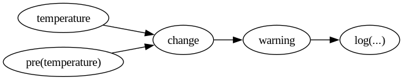

* Mold

Mold is a strongly typed, synchronous dataflow language designed for
embedding reactive computations into host programs.

Mold describes relationships between values rather than following a
fixed order of evaluation. The host application advances computations
in discrete steps called ticks.

** Overview

#+BEGIN_SRC text :tangle test/readme-01.mold
  in temperature : Real

  def change := temperature - pre(temperature) ? 0.0

  signal warning :=
    if temperature > 100.0 && change > 5.0
    then log("Rapid temperature increase")

  out log(msg : String)
#+END_SRC

The example defines a small dataflow

#+BEGIN_SRC dot :file img/readme-01-flow.png :exports none :results silent
  digraph G {
    rankdir = LR

    Temp -> Change
    Pre -> Change
    Change -> Warning
    Warning -> Log

    Temp [label = "temperature"]
    Change [label = "change"]
    Pre [label = "pre(temperature)"]
    Warning [label = "warning"]
    Log [label = "log(...)"]
  }
#+END_SRC

The host supplies =temperature=, advances program with ~tick()~, and
receives events and the results of computations.

#+BEGIN_SRC c++
  script.on("log",  {
    std::println("[LOG] {}", args[0]);
  });

  script.feed("temperature", {85.0});
  script.tick();

  script.feed("temperature", {105.0});
  script.tick();

  auto change = script.read("change");
#+END_SRC

** Execution model

Mold runs on discrete ticks. Conceptually,
 1. Host supplies inputs
 2. Mold evaluates the dataflow
 3. Signals dispatch events
 4. Host observes computed values and resulting events

A tick doesn't have to be tied to real time. Real clock time is
properly represented with ~Date~ and ~Time~ types. Ticks instead
represent an incremental computation, where each formula can be
thought of as a sequence rather than a single value. Past values in
this sequence are accessed with ~pre~.

** Basic concepts

Mold only has a few top-level components,
 - ~in~ represent variables that are fed by the host. These don't
   change unless ~feed~ is called by the host.
 - ~def~ are formulae that evaluate only as needed.
 - ~out~ represents event objects. A host can listen to these and
   receive any parameters.
 - ~signal~ are formulae that evaluate to specified event
   objects. Events are only dispatched if a signal holds them by the
   end of the tick. The same event is dispatched only once in a row,
   that is, dispatching requires the signal value to change.
 - ~extern~ represent native functions provided by the host. They are
   further specified as ~pure~ and ~impure~. This only signals a
   dependency relation. If a function (such as ~current_time()~) can
   change without any change to its parameters, it's ~impure~.
 - ~function~ are small templates that are inlined at use. This makes
   them polymorphic, meaning their parameters don't have fixed types.

Mold also has a fixed set of types:
 - Int (3, -6)
 - Real (3.14, -273.15)
 - Bool (true, false)
 - String ("Hello, world!")
 - Event
 - Date
 - Time

Additionally, each type can be nullable (denoted ~T?~, e.g. ~Int?~)
meaning the type is extended to permit =null=. The =null= value
propagates across operations in various ways,
 - Most standard operations propagate directly, ~2 + null = null~.
 - Coalescing operator can consume =null=, ~null ? 3 = 3~.
 - =null= is the smallest value of any type, ~null < x~, and it equals
   itself ~null = null~.

A complete example with the language may look as below,

#+BEGIN_SRC text :tangle test/readme-02.mold
  extern impure now() : Date
  extern pure milli(n : Int) : Time

  in temperature : Real

  out alert(current : Real, when : Date)
  out toggle_ac(on_off : Bool)

  # Change in temperatures, 0 initially
  def last_temp := pre(temperature) ? 0
  def change := if pre(temperature) /= null
                then temperature - last_temp
                else 0

  def sample_time :=
    if temperature /= pre(temperature)
      then now()
      else pre(sample_time) ? now()

  # ensure data is recent (<200ms)
  def recent := now() - sample_time < milli(200)

  def overload := recent && change > 5.0

  # dispatches on each increment
  signal alarm :=
    if overload
      then alert(temperature, sample_time)

  # dispatches once in a sequence of +5℃ increments
  signal ac_system := toggle_ac(overload)
#+END_SRC

Given a host such as,

#+BEGIN_SRC c++
  script.on("alert",  {
    auto current = std::get<double>(args[0].data);
    auto when = std::get<mold::Date>(args[1].data);
    std::println("(!) {}℃", current, when);
  });

  script.on("toggle_ac",  {
    auto on_off = std::get<bool>(args[0].data);
    if (on_off) {
      std::println("Opened AC");
    } else {
      std::println("Closed AC");
    }
  });

  script.implement("now",  -> mold::Value {
    return {std::chrono::system_clock::now()};
  });

  script.implement("milli",  -> mold::Value {
    auto n = std::get<std::int64_t>(args[0].data);
    return {std::chrono::milliseconds(n)};
  });

  std::vector<double> temps{15.1, 15.3, 15.6, 21.1, 26.3, 32.2, 25.5};

  for (auto temp : temps) {
    using namespace std::chrono_literals;
    script.feed("temperature", {temp});
    script.tick();
    std::println("Temp = {}", script.read("temperature"));
    std::this_thread::sleep_for(100ms);
  }
#+END_SRC

the expected output is

#+BEGIN_SRC text
Closed AC
Temp = 15.1
Temp = 15.3
Temp = 15.6
(!) 21.1℃
Opened AC
Temp = 21.1
(!) 26.3℃
Temp = 26.3
(!) 32.2℃
Temp = 32.2
Closed AC
Temp = 25.5
#+END_SRC

