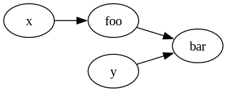

#+TITLE: Understanding Mold Runtime

Mold doesn't follow a traditional top-to-bottom execution
model. Instead, the runtime evaluates only necessary formulae by
following the dependency relations. Execution happens only on discrete
steps called ticks.

** Dependency Graph

Mold represents dependencies as a directed graph. Each edge on the
graph represents a "providing" relation. Example:

#+BEGIN_SRC text
  in x : Int
  in y : Int
  def foo := x * x
  def bar := foo + y
#+END_SRC

#+BEGIN_SRC dot :file ../img/doc-30-graph-1.png :exports none :results silent
  digraph G {
    rankdir = LR

    x -> foo
    foo -> bar
    y -> bar
  }
#+END_SRC

Dependencies guide evaluation. When the host feeds a new value for
~x~, the graph suggests that ~foo~ must be evaluated. To illustrate,
if ~x = 2~ initially, then ~foo = 4~. If the host then feeds ~x = 3~,
then ~foo~ must update to ~9~. This propagates further to ~bar~, which
has to update from ~4 + y~ to ~9 + y~.

However, each node can also decide on a cutoff. For example, if the
host were to feed ~x = -2~ instead of ~x = 3~ as in the last example,
then ~foo~ evaluates to ~4~ again. After this evaluation, ~foo~ no
longer propagates, and ~bar~ doesn't evaluate again, assuming ~y~
remains the same.

Due to the way the propagation works, if there were a cycle such as,

#+BEGIN_SRC text
  def x := y + 1
  def y := x + 1
#+END_SRC

then computation would not terminate. In general, since cycles can
diverge they are rejected with the exception of ~pre()~ (explained
later).

** Ticks
:PROPERTIES:
:CUSTOM_ID: ticks
:END:

When the host calls ~feed()~ and similar method on the ~Script~
object, it only marks a change, but it doesn't commit to it, and it
doesn't evaluate. Ticks are the discrete steps, triggered by the
~tick()~ method, where evaluation occurs and where changes are
committed.

The clearest mental model for ticks is to treat each formula as a
sequence. The tick provides the maximum range of the indices. For
example:

#+BEGIN_SRC text
  in y : Int
  def x := y * 2
#+END_SRC

has a sequence evolving at each tick as below

| Tick | Value fed to y | y                 | x                   |
|------+----------------+-------------------+---------------------|
|    0 |              5 | y = (5)           | x = (10)            |
|    1 |              3 | y = (5, 3)        | x = (10, 6)         |
|    2 |              6 | y = (5, 3, 6)     | x = (10, 6, 12)     |
|    3 |             11 | y = (5, 3, 6, 11) | x = (10, 6, 12, 22) |

In this model, each operation acts on sequences. For example, ~2~
defines a constant sequence of twos, and ~*~ multiplies corresponding
values of two sequences.

** Shifting the sequences

The ~pre()~ function reads old values of a top-level variable, such as
inputs and formulae. By default, it reads the last value, but
optionally a depth can be specified as a second argument to read the
last Nth value. Since ticks progress in steps, this value doesn't
always exist on the initial few ticks. In these cases, ~pre~ evaluates
to =null=.

Since ~pre~ is a lookup to old values, it doesn't change in a given
tick. As such, it doesn't cause a propagation loop, and is omitted
from dependencies. As a result, cycles such as the one below are
allowed, and these cycles progress over ticks.

#+BEGIN_SRC text
  in a : Int
  in b : Int
  def x := pre(y) ? 0 + a
  def y := pre(x) ? 0 + b
#+END_SRC

It should be noted that, since ~pre~ don't count toward dependencies,
these cycles don't progress on their own, and require triggering
dependencies (such as ~a~ or ~b~) to iterate, as with other formulae.

Using the sequence model defined in the [[#ticks][Ticks]] section, ~pre~ may be
treated as a right-shift on the sequence of a variable. Values that
shift past the current tick bounds are dropped, whereas values that
remain empty after the shift are filled with =null=.

For instance, using the table from the previous example, ~pre(x)~ and
~pre(x, 2)~ operate as below:

| x                   | ~pre(x)~              | ~pre(x, 2)~             |
|---------------------+-----------------------+-------------------------|
| x = (10)            | x = (null)            | x = (null)              |
| x = (10, 6)         | x = (null, 10)        | x = (null, null)        |
| x = (10, 6, 12)     | x = (null, 10, 6)     | x = (null, null, 10)    |
| x = (10, 6, 12, 22) | x = (null, 10, 6, 12) | x = (null, null, 10, 6) |

** Null arithmetic
:PROPERTIES:
:CUSTOM_ID: null_arith
:END:

Since operations act on entire sequences, =null= has well-defined
semantics in standard operations to allow for better interactions when
using ~pre~.

Most operations directly propagate =null=,

#+BEGIN_SRC text
  2 + null = null
  null / 6 = null
  5 >> null = null
#+END_SRC

For those coming from scripting languages, =null= interaction with
boolean operations may be unexpected. The standard ~value || default~
pattern fails since boolean operations also directly propagate null:

#+BEGIN_SRC text
  true && null = null
  null || true = null # <- Most languages take this as true
#+END_SRC

The defaulting pattern for Mold is instead the coalescing operator, ~?~.

#+BEGIN_SRC text
  null ? 3 = 3
#+END_SRC

Equals (~=~) and not equals (~/=~) are also operators that consume
=null=, producing only a direct boolean.

#+BEGIN_SRC text
  x = x # true
  x = null # false
  null = null # true

  x /= x # false
  x /= null # true
  null /= null # false
#+END_SRC

Inequality similarly operates with null, producing just a boolean. In
inequalities, ~null~ is defined as the smallest value, meaning ~x > null~,
~x >= null~ and ~null <= x~ always hold. For ~x < null~, it is
generally true, but since ~null < null~ is false (they are equal) it
doesn't generalise unlike the other cases.

For if/else expressions, ~null~ is treated the same as false,

#+BEGIN_SRC text
  if pre(x) /= null && pre(x) then 3 else 5
  # same as:
  if pre(x) then 3 else 5

  if true then 3 else 5 # 3
  if false then 3 else 5 # 5
  if null then 3 else 5 # 5
#+END_SRC

The null arithmetic allows for patterns such as:

#+BEGIN_SRC text
  def x := max(pre(x), y)
#+END_SRC

where, at tick zero, ~pre(x)~ is =null= and ~max(null, y)~ naturally
resolves to ~y~ since ~null~ is always smaller. Alternative patterns
have to use defaults such as a minimum integer constant or cleverly
default ~pre(x)~ to ~y~, though such handling is error-prone.

** Signals and events

An event in Mold is simply a value, and carries no special properties.

#+BEGIN_SRC text
  out sprinklers(level : Int)
  sprinklers(3) # Just a value of type `Event`
#+END_SRC

The dispatch mechanism of events lie in signals. A signal is a formula
that registers its value for dispatch if it changed after
evaluation. The dispatching may be thought of as a dependency that a
signal provides. For example,

#+BEGIN_SRC text :tangle ../test/doc-30-example-1.mold
  out alert(msg : String)
  out log(msg : String, temp : Int)
  # Temperature (℃)
  in temp : Int

  signal overheating :=
    if temp > 70
      then if temp - pre(temp) > 5
        then alert("Overheating fast")
        else alert("High temperature")
      else log("Chill temperature", temp)
#+END_SRC

with a host

#+BEGIN_SRC c++
  int main() {
    std::vector<std::int64_t> temps{65, 66, 65, 65, 71, 77, 78, 79};

    auto script = /* ...  */;

    script.on("alert",  {
      std::println("[SEVERE] {}", args[0]);
    });

    script.on("log",  {
      std::println("[INFO] {} -- {}℃", args[0], args[1]);
    });

    for (auto temp : temps) {
      script.feed("temp", {temp});
      if (auto res = script.tick(); !res.has_value()) {
        std::println("{}", res.error());
        assert(false && "Interpreter crash");
      }
    }
  }
#+END_SRC

is expected to output

#+BEGIN_SRC text
  [INFO] Chill temperature -- 65℃
  [INFO] Chill temperature -- 66℃
  [INFO] Chill temperature -- 65℃
  [SEVERE] Overheating fast
  [SEVERE] High temperature
#+END_SRC

It is important to emphasise that the dispatch only occurs on
change. From tick two to tick three, ~temp~ remains ~65~. Only the
first of these ticks emits the info. As opposed to this, from tick
zero to tick one, and from tick one to tick two, the ~temp~
fluctuates, each of the three ticks thus emits an event.

In the sequence model, the signal may be modelled with a deduplicating
function. The formula of the signal produces a value each tick, but
deduplication filters through the sequence and keeps only the first of
any run of the same values, replacing others with =null=.

To illustrate, the original sequence of ~overheating~ and the
deduplicated version are given below:

| Tick | Original                     | Deduplicated                 |
|------+------------------------------+------------------------------|
|    0 | log("Chill temperature", 65) | log("Chill temperature", 65) |
|    1 | log("Chill temperature", 66) | log("Chill temperature", 66) |
|    2 | log("Chill temperature", 65) | log("Chill temperature", 65) |
|    3 | log("Chill temperature", 65) | null                         |
|    4 | alert("Overheating fast")    | alert("Overheating fast")    |
|    5 | alert("Overheating fast")    | null                         |
|    6 | alert("High temperature")    | alert("High temperature")    |
|    7 | alert("High temperature")    | null                         |

** Purity and externs

Externs are marked with one of ~pure~ or ~impure~. In Mold, these
keywords only refer to dependency relations. A ~pure~ function is
evaluated only when any of its arguments change, whereas an ~impure~
function is evaluated each tick even if none of its arguments change.

For example, traditionally, a print function may be impure because it
has a side effect. In Mold, printing functions are instead often
treated as ~pure~, since printing an evaluated formula is a more
predictable behaviour than evaluating a formula only to run print. As
opposed to this, the ~Date.now()~ function is treated as impure since
its output changes even though it appears as a constant
dependency-wise (no arguments), and the the value being up-to-date is
semantically critical.

The choice of one over the other is not something enforced or checked
by Mold. A function that queries a database might be pure (if it
rarely updates, or if the call is expensive / should be cached) or
impure (the data must be up-to-date, and each tick queries the
database).

In terms of dependencies, it is better to treat the concepts as
separate. Pure functions are transformations, and a pure call ~f(x)~
is semantically similar to an operation like ~x + 1~. In contrast, an
impure call behaves more like an input that is called by the
runtime. An impure call ~f(x)~ is almost equivalent to providing
~f(x)~ in an ~in call_result : T~ each tick.
