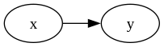

#+TITLE: Understanding Mold Runtime

Mold doesn't follow a traditional top-to-bottom execution
model. Instead, evaluation occurs in discrete steps called *ticks*,
where the runtime evaluates formulae by tracking synchronous
dependency relations.

** Dependency Graph

Mold models dependencies on a directed acyclic graph (DAG), where each
edge presents a "provides" or "causes" relation. The graph is
synchronous, and only answers the question of "what runs next on this
tick?". To illustrate:

#+BEGIN_SRC text
  in x : Int
  in y : Int
  def foo := x * x
  def bar := foo + y
#+END_SRC

#+BEGIN_SRC dot :file ./img/doc-30-graph-1.png :exports none :results silent
  digraph G {
    rankdir = LR

    x -> foo
    foo -> bar
    y -> bar
  }
#+END_SRC

[[file:./img/doc-30-graph-1.png]]

If the host feeds ~x~ a new value, that causes ~foo~ to run. For
example, if the host feeds ~x = 2~ and ~y = 4~, then the runtime first
considers ~foo~ and then ~bar~. First, ~foo~ evaluates to ~4~, then
~bar~ evaluates to ~8~.

However, a cutoff is also possible if a change doesn't occur at any
given node. For example, if the next tick feeds ~x = -2~ and ~y = 4~,
then ~y~ is immediately cut off. The runtime then considers ~foo~,
which evaluates to ~foo = 4~ again, so ~foo~ doesn't propagate a
change. In this situation, since neither ~y~ nor ~foo~ changed, ~bar~
doesn't re-evaluate.

** Ticks
:PROPERTIES:
:CUSTOM_ID: ticks
:END:

Mold doesn't react to changes as soon as they happen, instead
reactions only occur on individual ticks. For example, even if the
host calls ~feed()~, a change doesn't happen right away. Instead, the
~feed()~ is noted, but not committed until the next call to ~tick()~,
where evaluation actually occurs.

Treating each formula as a sequence, ~feed()~ only assigns a value to
the index at the current tick, and it isn't until a call to ~tick()~
that the ~feed()~ assigns to the next index. For example,

#+BEGIN_SRC text
  in y : Int
  def x := y * 2
#+END_SRC

has a sequence evolving at each tick as below

| Tick | Value fed to y | y                 | x                   |
|------+----------------+-------------------+---------------------|
|    0 |              5 | y = (5)           | x = (10)            |
|    1 |              3 | y = (5, 3)        | x = (10, 6)         |
|    2 |              6 | y = (5, 3, 6)     | x = (10, 6, 12)     |
|    3 |             11 | y = (5, 3, 6, 11) | x = (10, 6, 12, 22) |

In this model, each operation acts on sequences. For example, ~2~
defines a constant sequence of twos, and ~*~ multiplies corresponding
values of two sequences.

** Shifting the sequences

Using the sequence model from before, the ~pre()~ operation shifts
known terms of a sequence, like a bitshift for numbers. Similar to the
bitshift, ~pre()~ fills in missing digits with a zero value, =null=.

For instance, for an ~x~ computed by some means, ~pre(x)~ and ~pre(x, 2)~ are as
below.

| Tick | x                   | ~pre(x)~              | ~pre(x, 2)~             |
|------+---------------------+-----------------------+-------------------------|
|    0 | x = (10)            | x = (null)            | x = (null)              |
|    1 | x = (10, 6)         | x = (null, 10)        | x = (null, null)        |
|    2 | x = (10, 6, 12)     | x = (null, 10, 6)     | x = (null, null, 10)    |
|    3 | x = (10, 6, 12, 22) | x = (null, 10, 6, 12) | x = (null, null, 10, 6) |

Since ~pre()~ only shifts in values from past ticks, it isn't a
synchronous value, and it doesn't constitute a dependency. This means
that, while cycles aren't allowed on the dependency graph (it's
acyclic), a logical cycle may be created with ~pre()~ and made to
evolve across ticks.

Rejected (cyclic dependency x -> y and y -> x):

#+BEGIN_SRC text
  in a : Int
  in b : Int
  def x := y + a
  def y := x + b
#+END_SRC

Allowed (pre(x) and pre(y) aren't dependencies):

#+BEGIN_SRC text
  in a : Int
  in b : Int
  def x := pre(y) ? 0 + a
  def y := pre(x) ? 0 + b
#+END_SRC

However, since ~pre~ calls aren't dependencies, such a cycle isn't
self-triggering. For instance,

#+BEGIN_SRC c++
  std::vector<std::int64_t> as{5, 9, 1, 1, 6};
  std::vector<std::int64_t> bs{2, 2, 3, 7, -4};

  for (auto [a, b] : std::views::zip(as, bs)) {
    script3.feed("a", {a});
    script3.feed("b", {b});
    if (auto res = script3.tick(); !res.has_value()) {
      std::println("{}", res.error());
      assert(false && "Interpreter crash");
    }
    std::println("x = {} | y = {}", script3.read("x"), script3.read("y"));
  }
#+END_SRC

If the formulae were evaluated on each tick, this would have output

#+BEGIN_SRC text
  x = 5 | y = 2
  x = 11 | y = 7
  x = 8 | y = 14
  x = 15 | y = 15
  x = 21 | y = 11
#+END_SRC

However, since ~x~ is tied only to ~a~ as a dependency, it doesn't
evaluate on tick 3, and since ~y~ is tied only to ~b~ as a dependency,
it doesn't evaluate on tick 1. This gives a real output of

#+BEGIN_SRC text
  x = 5 | y = 2
  x = 11 | y = 2 (!)
  x = 3 | y = 14
  x = 3 (!) | y = 10
  x = 16 | y = -1
#+END_SRC

where the ~(!)~ editorially marks the danger sections where evaluation
didn't occur.

In this case, ~x~ and ~y~ had natural triggers on the dependency
graph. However, given an example like the one below:

#+BEGIN_SRC text
  def x := max(1, pre(x) + 1)
  def y := x * 2
#+END_SRC

#+BEGIN_SRC dot :file ./img/doc-30-graph-2.png :exports none :results silent
  digraph G {
    rankdir = LR

    x -> y
  }
#+END_SRC

The graph hints that ~x~ has no triggers. Without the ~pre()~
operations, such nodes only exist for inputs (~in x : Int~) and
constant values (~def x := 10~). So similarly, the dependency graph
suggest that ~x~ here must be a constant too. However, the runtime
relaxes the rules in this case to evaluate the source node anyways,
allowing ~x~ to increment on each tick. This can be reasoned as the
tick progression itself being a dependency.

#+BEGIN_SRC c++
  for (std::int64_t t = 1; t < 10; ++t) {
    if (auto res = script.tick(); !res.has_value()) {
      std::println("{}", res.error());
      assert(false && "Interpreter crash");
    }
    std::println("x = {} | y = {}", script.read("x"), script.read("y"));
  }
#+END_SRC

#+BEGIN_SRC text
  x = 1 | y = 2
  x = 2 | y = 4
  x = 3 | y = 6
  x = 4 | y = 8
  x = 5 | y = 10
  x = 6 | y = 12
  x = 7 | y = 14
  x = 8 | y = 16
  x = 9 | y = 18
#+END_SRC

The key takeaway is that ~pre~ calls only bring old values into view
without causing a re-evaluation as the history naturally
changes. Evaluation is tied only to synchronous dependencies and tick
progression.

** Null arithmetic
:PROPERTIES:
:CUSTOM_ID: null_arith
:END:

Since operations act on entire sequences, =null= has well-defined
semantics in standard operations to allow for better interactions when
using ~pre~.

Most operations directly propagate =null=,

#+BEGIN_SRC text
  2 + null = null
  null / 6 = null
  5 >> null = null
#+END_SRC

For those coming from scripting languages, =null= interaction with
boolean operations may be unexpected. The standard ~value || default~
pattern fails since, beside being a type error for most cases, boolean
operations also directly propagate null:

#+BEGIN_SRC text
  true && null = null
  null || true = null # <- Most languages take this as true
#+END_SRC

The defaulting pattern for Mold is instead the coalescing operator, ~?~.

#+BEGIN_SRC text
  null ? 3 = 3
#+END_SRC

Equals (~=~) and not equals (~/=~) are total over =null=, producing
only a direct boolean.

#+BEGIN_SRC text
  x = x # true
  x = null # false
  null = null # true

  x /= x # false
  x /= null # true
  null /= null # false
#+END_SRC

Inequality is similarly total over =null=, producing just a
boolean. In inequalities, ~null~ is defined as the smallest value. To
illustrate, ~null < x~ for non-null x is always true, similarly ~null
> x~ is always false for non-null x.

For if/else expressions, ~null~ is treated the same as false,

#+BEGIN_SRC text
  if pre(x) /= null && pre(x) then 3 else 5
  # same as:
  if pre(x) then 3 else 5

  if true then 3 else 5 # 3
  if false then 3 else 5 # 5
  if null then 3 else 5 # 5
#+END_SRC

The null arithmetic allows for patterns such as:

#+BEGIN_SRC text
  def x := max(pre(x), y)
#+END_SRC

where, at tick zero, ~pre(x)~ is =null= and ~max(null, y)~ naturally
resolves to ~y~ since ~null~ is always smaller. Alternative patterns
have to use defaults such as a minimum integer constant or cleverly
default ~pre(x)~ to ~y~, though such handling is error-prone.

** Signals and events

An event in Mold is simply a value, and carries no special properties.

#+BEGIN_SRC text
  out sprinklers(level : Int)
  sprinklers(3) # Just a value of type `Event`
#+END_SRC

The dispatch mechanism of events lie in signals. A signal is a formula
that registers its value for dispatch if it changed after
evaluation. The dispatching may be thought of as a dependency that a
signal provides. For example,

#+BEGIN_SRC text :tangle ../test/doc-30-example-1.mold
  out alert(msg : String)
  out log(msg : String, temp : Int)
  # Temperature (℃)
  in temp : Int

  signal overheating :=
    if temp > 70
      then if temp - pre(temp) > 5
        then alert("Overheating fast")
        else alert("High temperature")
      else log("Chill temperature", temp)
#+END_SRC

with a host

#+BEGIN_SRC c++
  int main() {
    std::vector<std::int64_t> temps{65, 66, 65, 65, 71, 77, 78, 79};

    auto script = /* ...  */;

    script.on("alert",  {
      std::println("[SEVERE] {}", args[0]);
    });

    script.on("log",  {
      std::println("[INFO] {} -- {}℃", args[0], args[1]);
    });

    for (auto temp : temps) {
      script.feed("temp", {temp});
      if (auto res = script.tick(); !res.has_value()) {
        std::println("{}", res.error());
        assert(false && "Interpreter crash");
      }
    }
  }
#+END_SRC

is expected to output

#+BEGIN_SRC text
  [INFO] Chill temperature -- 65℃
  [INFO] Chill temperature -- 66℃
  [INFO] Chill temperature -- 65℃
  [SEVERE] Overheating fast
  [SEVERE] High temperature
#+END_SRC

It is important to emphasise that the dispatch only occurs on
change. From tick two to tick three, ~temp~ remains ~65~. Only the
first of these ticks emits the info. As opposed to this, from tick
zero to tick one, and from tick one to tick two, the ~temp~
fluctuates, each of the three ticks thus emits an event.

In the sequence model, the signal may be modelled with a deduplicating
function. The formula of the signal produces a value each tick, but
deduplication filters through the sequence and keeps only the first of
any run of the same values, replacing others with =null=.

To illustrate, the original sequence of ~overheating~ and the
deduplicated version are given below:

| Tick | Original                     | Deduplicated                 |
|------+------------------------------+------------------------------|
|    0 | log("Chill temperature", 65) | log("Chill temperature", 65) |
|    1 | log("Chill temperature", 66) | log("Chill temperature", 66) |
|    2 | log("Chill temperature", 65) | log("Chill temperature", 65) |
|    3 | log("Chill temperature", 65) | null                         |
|    4 | alert("Overheating fast")    | alert("Overheating fast")    |
|    5 | alert("Overheating fast")    | null                         |
|    6 | alert("High temperature")    | alert("High temperature")    |
|    7 | alert("High temperature")    | null                         |

** Purity and externs

Externs are marked with one of ~pure~ or ~impure~. In Mold, these
keywords only refer to dependency relations. A ~pure~ function is
evaluated only when any of its arguments change, whereas an ~impure~
function is evaluated each tick even if none of its arguments change.

For example, traditionally, a print function may be impure because it
has a side effect. In Mold, printing functions are instead often
treated as ~pure~, since printing an evaluated formula is a more
predictable behaviour than evaluating a formula only to run print. As
opposed to this, the ~Date.now()~ function is treated as impure since
its output changes even though it appears as a constant
dependency-wise (no arguments), and the the value being up-to-date is
semantically critical.

The choice of one over the other is not something enforced or checked
by Mold. A function that queries a database might be pure (if it
rarely updates, or if the call is expensive / should be cached) or
impure (the data must be up-to-date, and each tick queries the
database).

In terms of dependencies, it is better to treat the concepts as
separate. Pure functions are transformations, and a pure call ~f(x)~
is semantically similar to an operation like ~x + 1~. In contrast, an
impure call behaves more like an input that is called by the
runtime. An impure call ~f(x)~ is almost equivalent to providing
~f(x)~ in an ~in call_result : T~ each tick.
